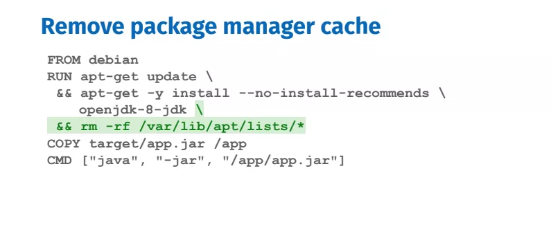

# Best practice for writing Dockerfiles

Write a better Dockerfiles means:
- incremental build time
- image size
- maintainability
- security and repeatability

## Incremental build time

Development cycle
- build a Docker image
- make code changes
- rebuilding   

🌟 important to use caching

### Tip #1: Order matters

Order steps from least to most frequently changing steps to optimize caching.

❓ Why?  
A step's cache is invalidated by changing files or modifying lines in the Dockerfile

### Tip #2: More specific COPY

❓ Why  
Any changes to the files being copied will break the cache

### Tip #3: Identify cachable units such as apt-get update & install

❓ Why   
When installing packages from package managers, always should update the index and install packages at the same RUN because they form as a cachable unit.
Otherwise you risk installing outdated packages.

## Reduce image size

Smaller images equal faster deployments and a smaller attach surface.

### Tip #4: Remove unncessary dependencies

- Remove unncessary dependencies, do not install debugging tools.
- Add --no-install-recommends flag to ensures unnecessary dependencies not installed.

### Tip #5: Remove package manager cache
- Package managers maintain their own cache which may end up in the image, so you should remove the cache in the same RUN instruction that installed package. Removing it in another RUN instruction would not reduce the image size.

## Maintainability
### Tip #6: Use official images when possible
- Official images save time spent on maintainance because all the installation are done and best practices are applied.

### Tip #7: Use specific tags
- Do not use the latest tag because the breaking changes will happen over time.
- If you rebuild the Dockerfile without cache, you may have failing builds

### Tip #8: Look for