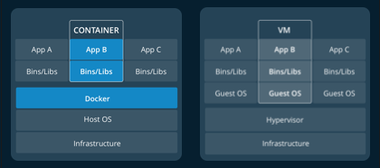

# Dockers

- [Dockers](#dockers)
	- [Orientation](#orientation)
		- [Concepts:](#concepts)
		- [Images, containers](#images-containers)
		- [Containers, virtual machines](#containers-virtual-machines)
		- [Cheat sheet](#cheat-sheet)
		- [Conclusion](#conclusion)

## Orientation

### Concepts:
Containerization is 
- Flexible : all apps can be containerized.
- Lightweight: levarage, share the host kernel
- Interchangeable: deploy updates, upgrades on-the-fly
- Scalable: increase, distribute container replicas
- Stackable: stack services vertically and on-the-fly

### Images, containers

An image is an executable package that includes everything to run an app (code, runtime, libraries, evn var, config files)

An container is a runtime instance of an image.

Command: List running containers
```
docker ps
```

### Containers, virtual machines

An container shares the kernel of the host machine with other containers.

A Virtual machine runs a full-blown "guest" OS.




### Cheat sheet

```
## List Docker CLI commands
docker
docker container --help

## Display Docker version and info
docker --version
docker version
docker info

## Run an image
docker run hello-world
## List all images
$ docker image ls

## List containers (running, all, all in quite mode)
docker container ls
docker container ls --all
docker container ls -aq
```
### Conclusion
Containerization makes CI/CD seamless.
- no dependencies. everything in one container/image
- updates can be pushed to any part of a distributed app
- resource is optimized

Scaling application is a matter of spinning up new executables not running heavy VM hosts.

