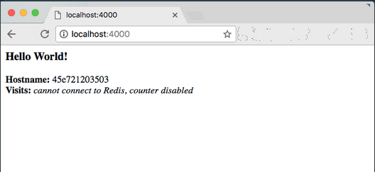

# Docker
## Containers

### Overview

- Stack
- Services
- Container


### Dockerfile

```
# Use one image as a parent image
FROM python:2.7-slim

# Set working directory to /app
WORKDIR /app

# Copy the current directory contents to the container at /app
COPY . /app

# Install any packages in requirement.txt
RUN pip install --trusted-host pypi.python.org -r requirements.txt

# Make port 80 available to the outside the container
EXPOSE 80

# Define env variable
ENV NAME World

# Run app.py when the container launches
CMD ["python", "app.py"]

```

### Build app

```
$ docker build --tag=friendlyhello .
```

The cmd above is to build an image
```
$ docker image ls
REPOSITORY            TAG                 IMAGE ID
friendlyhello         latest              326387cea398
```

### Run app

Run the app, mapping host port 4000 to the container's port 80:
```
$ docker run -p 4000:80 friendlyhello
```



List container
```
$ docker container ls
CONTAINER ID        IMAGE               COMMAND             CREATED
1fa4ab2cf395        friendlyhello       "python app.py"     28 seconds ago
```

Stop container
```
$ docker container stop 1fa4ab2cf395
```

### Share image
Push image to registries

A registry is a collection of repositories
A repository is a collection of images (similar Git repository, but already compiled to binary package)

docker CLI uses Docker's public registry by default.