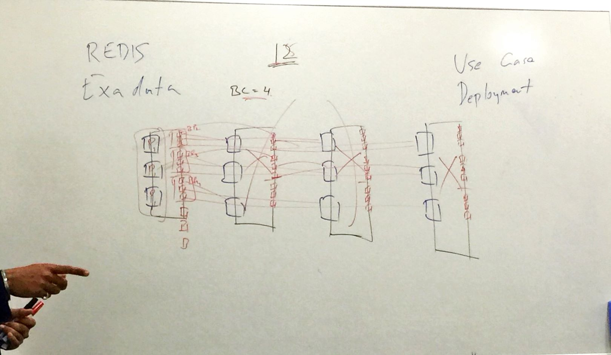
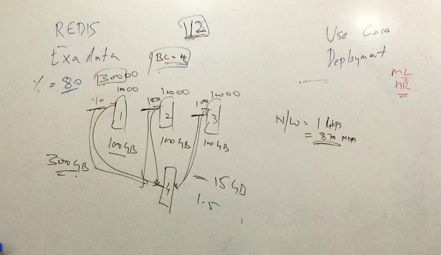

# Hazelcast

## Technology
- Batch deal with data-at-rest
  - Hazelcast IMDG
- Stream deal with data-in-motion.
  - Hazelcast Jet

Hazelcast In-Memory Computing Platform

## Hazelcast in nutshell

Data storage + computing + messaging

### Cluster

> what is a cluster?    
> a set of connected computers work together as they can be viewed as a single system

Hazelcast cluster consists of multiple Hazelcast members that look like a single service

### Topologies
- Embedded Mode (Members only)
  - Only for Java
- Client-Server Mode


### Forming a cluster

Factory function to create a Hazelcast member of client
```
Hazelcast.newHazelcastInstance();
HazelcastClient.newHazelcastClient();
```

## Data Storage
### Partitioning
Partition = 217

ConsistentHashing

Client maintains partition table

> Smart routing enabled?
> Client directly connect to node which stores data.

Type of partition:
- Primary partition
- Backup partition



Rule of thump for failure
- Keep consistent configuration across nodes
- Keep in mind in case of failure, the memory ultilisation will increase in all nodes. 

Master node always be the first node of the cluster.


> Determine of object size?   
> Be mindful with
> - Serialize, Deseriablize time
> - Network IO





**Persistence**


## Security Suite

- SSL impl only decrease 5-10% of the latency 

## CAP

Consistency / Availability / Partition