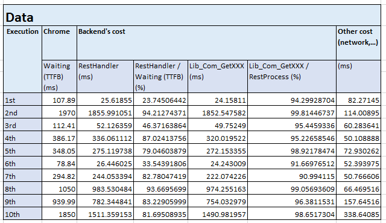

# How to approach backend performance measurement task
This guideline describes the steps you can approach a backend performance measurement task.

## Step 1: Add measuring codes to log performance data

There are three important attributes to be logged:
- Waiting (TTFB)   
The browser is waiting for the first byte of a response. TTFB stands for Time To First Byte. This timing includes 1 round trip of latency and the time the server took to prepare the response.   
Tool to record: Chrome DevTool, Firefox DevTool.   
Reference: https://developers.google.com/web/tools/chrome-devtools/network/reference#timing-explanation

- Backend's cost   
This is the time-taken which backend need to handle one request.

- Critical functions   
The critical functions take the largest proportion in the backend processing. Your task is much easier if you can find a tool allowing to point out the critical functions. If not, you have to add measuring code in functions and keep doing it until you found out the critical functions.

## Step 2: Collect the data
- Collect data in a table as follows:

## Step 3: Present insights from performance data
Present insights from the performance data:   

- Expensive functions:   
`Pie chart` is the best chart type to represent proportion data.

- Data varies:
In real cases, the critical function's time-taken often varies. You should represent it as `Scatter` chart.  

