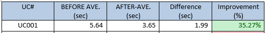

# How to optimize a web app

This guideline describes how you can approach an optimization task for a (legacy) web application. The approaches are meant to be framework-agnostic.

## Step 1: Determine Use Cases to be measured
It is important to find some critical use cases which are used to base line the current performance data and measure improvement prototypes.

There are some notes as follows:
- Remove all unnecessary layers between front-end and back-end such as proxy.
- Automate web execution, performance recording, and performance data extraction.   
Some automated or RPA tools can be used such as Selenium IDE, UI Path.
To extract performance data from HAR file Chrome DevTool, I developed a library to automatically extract the time-taken
https://github.com/tnngo2/frontend-performance-analyzer

- Keep backend close to the testing client to minimize the impact of networking latency e.g put in the same PC.

## Step 2: Analyse performance

### HTTP requests
The more network request is sent, the lower users load the page. The more network request results in increasing stalling time and waiting time in fetching data.
Each network request consumes a connection resource. A normal browser is limited to serving only a certain number of simultaneous connections to a single host.

One of the solutions for legacy application is that you could create a method which debounces network requests and combine them in one single network request.

### Defer unnecessary loading during page loading.

Basically, models are falling into three types of their usages:

-    Initial View: used to display in the initial view.
-    Modal Dialog only: used to display in Modal Dialogs only.
-    Un-used: not used in both initial view and model dialogs.

For example:   
As shown in the figure below, although `WirelessLANStatus` and `ProductName` are not used to display in both initial view and modal dialogs of the Home page, it is still being fetched in the page initialization.

Since `WirelessLANStatus` and `ProductName` are `un-used` models, we will not fetch them.

This strategy is possible to bring down a significant amount of the page loading as the use case UC001 below.

### Network compression
HTTP compression is a capability that can be built into web servers and web clients to improve transfer speed and bandwidth utilization. HTTP data is compressed before it is sent from the server, browsers will determine download compressed or uncompressed data based on the compliant compression method. GZIP is one of the most common compression schemes, being supported by most browsers currently.

To compress responses responding from the backend, you can set up a reversed proxy which performs as an immediate layer between User and backend’s communication. The reversed proxy will receive a normal request from a user, forward it to the backend, receive a normal response from the backend, and compress the response before sending it to the user.

### Caching
- Use CDN to cache static files
- Browser cache   
Local Storage, Application Cache (obsolete), Service Worker.
Below is the comparison between browser caching methods in my application.

### Code minification
This is definitely a common solution. You can add the minification process to your current build process  (gulp, grunt ...).

### Step 3: Prototype   
In this step, we start to develop prototypes.

The result of each prototype is measured by the performance data recorded by the automated script created in Step.1. Then you can come out with the performance comparison table as follows:

